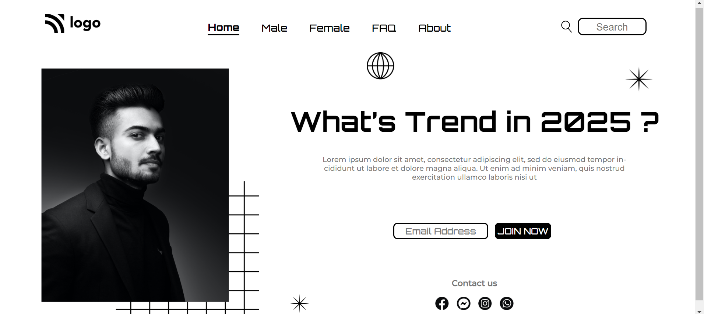

# **Street Style Landing Page | Project_01**

Hello, I'm **Vikash Yadav** 

This project is a part of the **Full Stack Javascript** course by ineuron.ai. It is given by our instructor and mentor, **Hitesh** sir,  as an assignment.

### **What I have learned ?**

In this, I have learned about **CSS positioning property** and **z-index property**, and how to use it to position and stack the elements in the document.

### **Time spent to finish it.**

It took me 5 to 6 hours to complete this project.

**[Live Project's netlify link](https://street-style-landing-page-project-01.netlify.app/ "Project link")**

